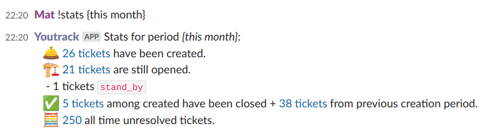
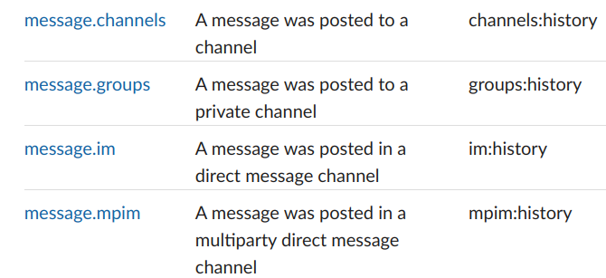
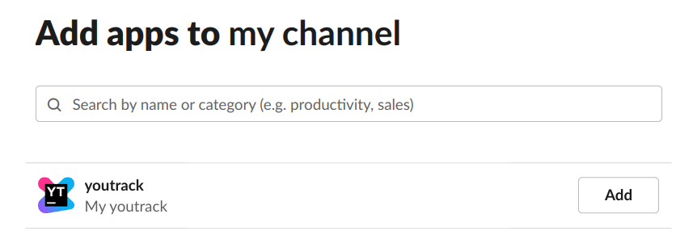

# Youtrack Slack bot
A slack bot which can query youtrack, get stats, realtime tracking, ...

# Configuration

Create a slack app: https://slack.com/help/articles/13345326945043-Build-apps-with-Slacks-developer-tools

Then, in App Home, check "Allow users to send Slash commands and messages from the messages tab"
In Event permissions, add following events:

Fill config.ini bearer for youtrack section and tokens + signing secret for slack section.

# Run
Either run youtrack-slackbot.py file or use Dockerfile to do so.

$ docker build -t youtrack-slackbot
$ docker run -d -v ./config:/config youtrack-slackbot

Add the bot on every channel where you want to chat with:

Type :
`!help`

to list available commands.

First set a youtrack query using `!set_query` command,
eg: `!set_query #Unresolved`

You can then display stats or digest, and you can also get them in recurring way enabling modules:
`!enable tracking polling` will poll every minute youtrack with your query and send a message for new created tickets.
`!enable stats daily 9:00` will display stats every day at 9am.
